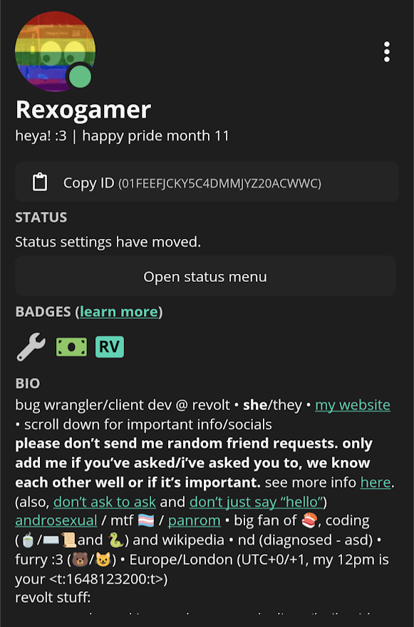
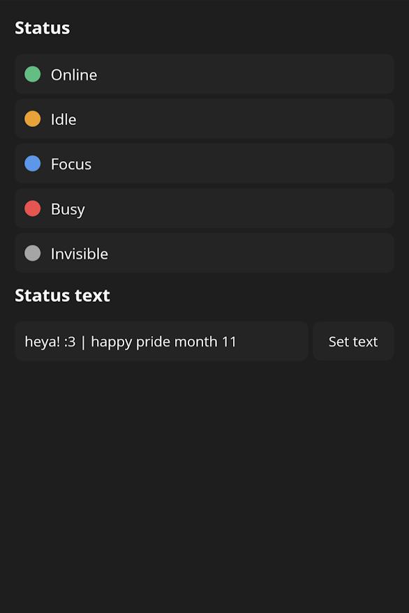
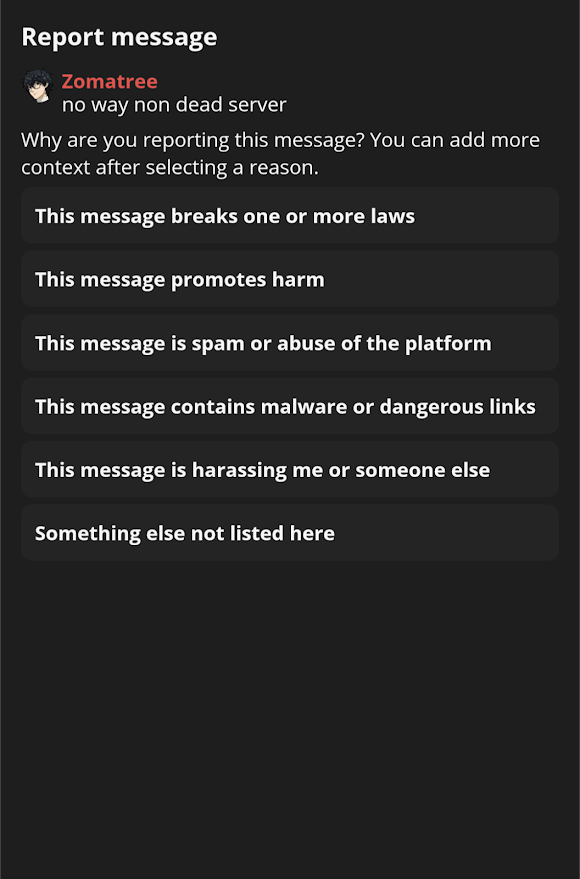
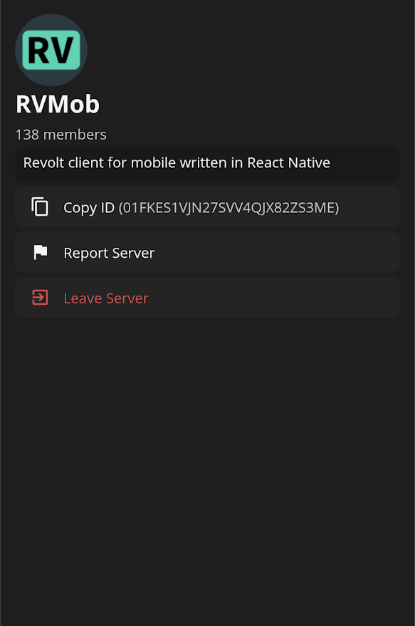
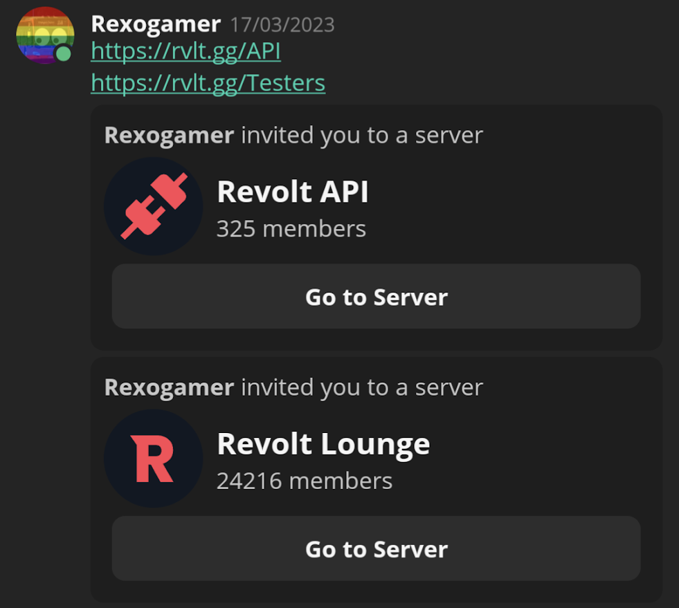
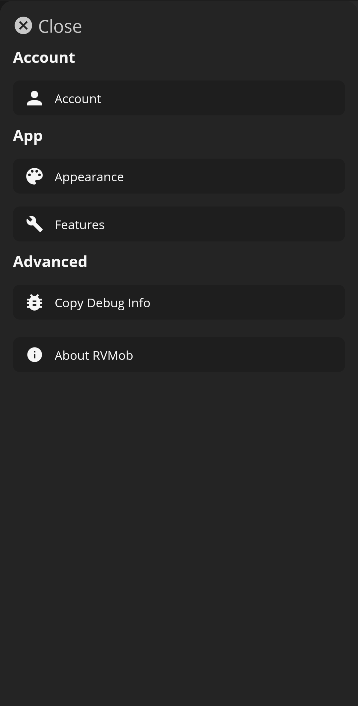
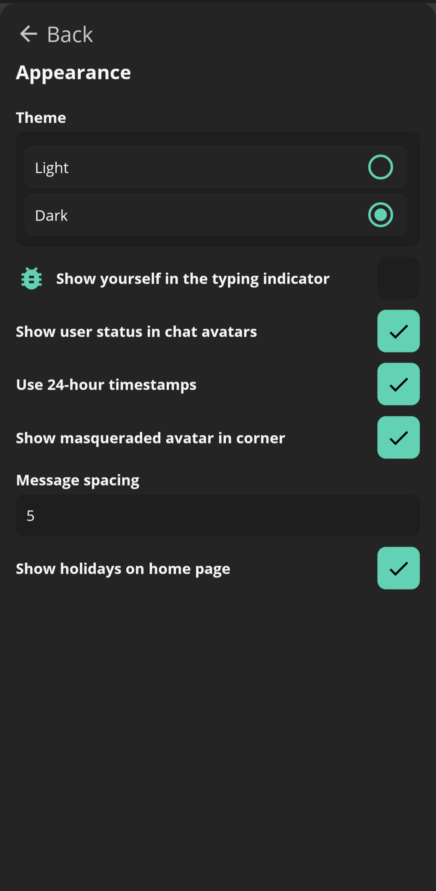

# Clerotri's changelog

## v0.7.1

_This version was released on 27/01/2025._

​### What's new

- In-app notifications now look better, with proper alignment and shadows.

​### Bug fixes

- Switching between themes will no longer cause the app to crash.
- Messages should no longer duplicate/appear in the wrong channels.

## v0.7.0

_This version was released on 25/01/2025._

Please note that the changelog for this version is incomplete. It's been over a year since v0.6.0, and [with over 500 commits][commits] I can't bring myself to sift through everything right now. I might at some point - alternatively, community contributions are more than welcome :3

​### Important notes

- You might've noticed something different: **the app has a new name and icon!** RVMob is now known as **Clerotri**, inspired by the [_Clerodendrum trichotomum_][flower].
- **Breaking change:** the app's bundle identifier has changed to `app.upryzing.clerotri`, meaning that **this update will install as a new app**, your settings **won't migrate** and **you'll need to log back in**. I sincerely apologise for the inconvenience, but I swear this will be the last time for the foreseeable future that you'll need to do anything major when updating.
- **Breaking change:** the app now _actually_ requires Android 7. It was the listed minimum version for v0.6.0, but the minimum SDK was set to Android 5 - this has now been fixed. (This isn't really much of a breaking change, though - Android 5/6 were never _officially_ supported, and I doubt anyone was using RVMob on them... if it even worked :eye::eye:)
- Clerotri is **now on the Fediverse!** I'll be posting updates and proving some amount of support at [`@clerotri@lea.pet`][fedi].

​### What's new

- As promised when I released v0.6.0: Clerotri now has **server settings!** Edit your server's info, revoke bans and invites, kick that one person who never seems to read the channel topic despite repeated warnings when it's literally _RIGHT THERE_- and much more.
- Now for a fun surprise... **translations!** Yes, you read that correctly - **Clerotri now has support for other languages**. v0.7.0 includes support for a few languages, and more will be added in future updates.
  - Speaking of which... if you speak another language well, **you can get involved!** Go to [Revolt's Weblate instance][weblate] and create an account there, then select your language (or start a new translation if it isn't already listed) and get translating!
  - If you need any help, have questions about a particular translation or just want to chat with other translators, I'd also recommend joining the **official [Revolt Translators server][revolt_translators]**. You don't need to be a translator to join, either - if you're just curious about how it works or want to see what's going on, feel free to stop by!
- The app now lets you browse servers on [Discover][discover]! Support for bots will be added in the future.
- Clerotri has added support for **pinned messages**! They were added relatively recently to Revolt, but to my knowledge they aren't available in any other clients yet 👀
- Now for some smaller tweaks and improvements:
  - uh some other things
  - The server info sheet now lets you know whether a server is publicly joinable via Discover and shows badges for verified/official servers.
- Clerotri now uses React Native 0.76 and targets Android 14. Not quite as exciting as the rest of these, but it's nice to be up to date :3
  - (The app should be smaller and faster as a result, though.)

​### Experimental/WIP features

TBD

​### Bug fixes

- Servers that aren't explicitly ordered in the synced server list will now correctly show at the bottom - in other words, you won't have to drag them about on the web app first.

​### Known issues

TBD

[commits]: https://github.com/upryzing/clerotri/compare/v0.6.0...v0.7.0
[flower]: https://en.wikipedia.org/wiki/Clerodendrum_trichotomum
[fedi]: https://lea.pet/@clerotri
[weblate]: https://translate.revolt.chat/projects/rvmorb/
[revolt_translators]: https://rvlt.gg/i18n
[discover]: https://rvlt.gg

## v0.6.0

_This version was released on 14/07/2023._

### Important info for users of 0.5.0 or earlier

If you're one of the people using 0.5.0 or older versions of RVMob, you'll need to **clear your app data** before upgrading. To do this:

- Open the Settings app
- Go to the Apps section and search for RVMob
- Select the option labelled "Storage and cache" or similar
- Select "Clear storage" and optionally "Clear cache"

(These steps may vary depending on your device's manufacturer/your version of Android.)

This is a **one time operation** - in future, any major changes to the settings system will include migrators for existing users. You'll also have to log back in after doing this.

### What's new

- RVMob now uses React Native 0.72 (including Hermes, which provides various improvements)/Typescript.
- You can now log in using your email/password!
  - There's also partial 2FA support; you can log in using one-time codes.
- Profiles have been largely redesigned, making them less cramped and better suited for future features.
  - As part of this work, status settings have been moved to their own menu.
- RVMob now supports [Revolt's reports system][revolt_reports_post]. This allows you to flag up messages, servers and users that violate Revolt's [Terms of Service][revolt_tos] or the [Acceptable Use Policy][revolt_aup], helping to keep the platform safe.
  - To report a message, long tap it and select "Report Message".
  - To report a server, tap its name above the channel list and select "Report Server".
  - To report a user, open their profile, tap the three dots next to their profile picture and select "Report User".
- The settings system has been fully reworked, making it more maintainable and easier to work with.
  - Alongside this, the settings menu has received various visual improvements.
  - Settings are now split into categories, making the menu feel less cluttered.
  - In addition, you can now copy useful debug information (including your device model, your current settings and your version of Android) - if you're reporting a bug, please include this info.
- The right menu (which was largely unused) has been removed - instead, the member list and channel description are now available via dedicated buttons at the top of the channel view.
- The home screen now shows an emoji/link for certain holidays/special dates.
- In line with the web app:
  - DMs are now sorted by when the last message was sent.
  - Servers are now sorted in the order you reorder them to.
  - Users in the friends list are now sorted by username, and individual sections can now be collapsed.
  - You can now collapse categories in the server channel list.
- Server invites now embed below the message.
- You can now leave servers via the server info sheet.
- Messages from blocked users are now hidden.
- A variety of design improvements have been made across the app - in particular, various elements have bigger margins, making the app feel less crowded.
- The server invite screen and info sheet now show how many members the server has.
- Various code improvements have also been made, making the code much easier to navigate and maintain.
- The navigation bar now uses the colour of the message box.

#### Experimental/WIP features

- Custom emojis in messages will now be detected and replaced with a link - proper rendering will hopefully be added in a future update.
- Embeds specified by bots will now be partially rendered - better styling and support for fields like custom colours will be added in a future update.
- Notifications should work while the app is open in the background, and basic support for in-app notifications has been added.
- Reactions can now optionally be shown under messages! You can also add to existing reactions if you have the React permission - further functionality (i.e. adding new reactions/seeing who's reacted) will be added in a future update.

### Screenshots

#### New profiles

#### Status menu

#### Reporting menu

#### Updated server info sheet

#### Server invite embeds

#### Revamped settings menu

### Known issues

- When opening the app for the first time, it might get stuck on the "Logging in..." screen. If this happens, close and re-open the app via the app switcher. This seems to only happen on the first boot and is inconsistent - I'm still trying to figure out why this occurs.
- The app is a bit laggy in places - in particular, the friends list can take a bit to load.
- The app may freeze up when trying to fetch the member count in larger servers - due to this, this feature has been turned off for the Revolt Lounge, which during testing was particularly bad in this regard.
- Most gradient roles will appear as plain black text (excluding basic linear gradients, which will show as the first colour in the gradient). This is partially a React Native limitation; however, a better mitigation for this will be added in a future update.
- The image viewer may incorrectly crop certain images, rendering parts of them invisible. You can open them in the browser to view the full image.
- The Send Friend Request button on profiles might not work - I'm still trying to figure out why.

### What's next

- Recovery code support for 2FA
- Full support for reactions
- Server/channel settings
- New message view (code wise)
- Even more code improvements

[revolt_tos]: https://revolt.chat/terms
[revolt_aup]: https://revolt.chat/aup
[revolt_reports_post]: https://revolt.chat/posts/improving-user-safety?utm_source=rvmob_changelog_0.6.0
