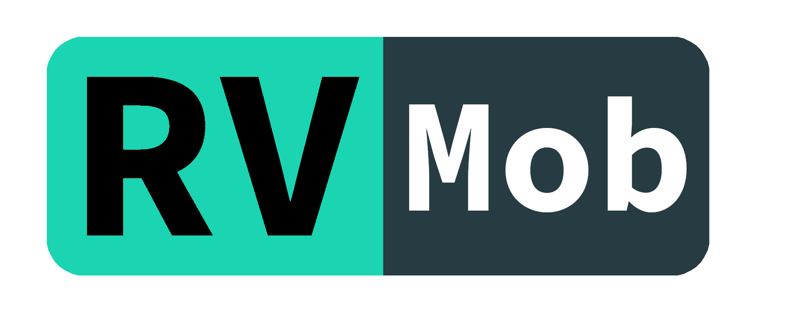
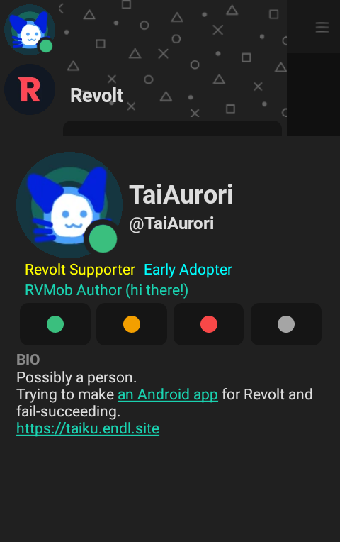
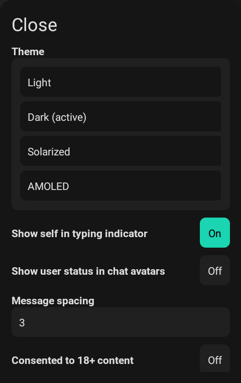
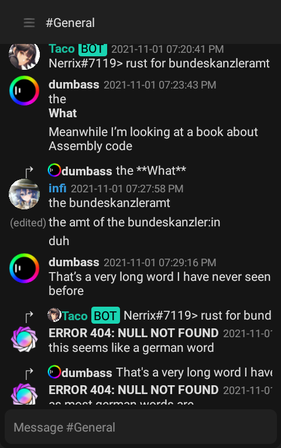

    

React Native Revolt client (now semi-official!)
Beta stage, pretty unoptimized. Use at your own discomfort.

Revolt server for RVMob [here](https://app.revolt.chat/invite/YW312HPF).

After running `npm i`, you must run `npx rn-nodeify -e -i` because React Native does not have 100% compatibility with Node.js (and therefore revolt.js) by default.

    
    
    
    
    

